# AI Support Agent System

## Brief Introduction

The AI Support Agent System is an intelligent customer support automation platform designed for Rocket.new - a no-code application development platform. This system automatically monitors Gmail for incoming customer support emails, processes them using AI, and generates contextual draft responses for human review and approval.

## What It Does

The system operates as a 24/7 automated support agent that:

- **Monitors Gmail**: Continuously polls Gmail for new customer support emails
- **Categorizes Emails**: Uses Google Gemini AI to automatically classify emails by type and urgency
- **Searches Documentation**: Retrieves relevant documentation and historical examples from vector databases
- **Generates Drafts**: Creates contextual, professional email draft responses using AI
- **Human Review**: Sends drafts to a web interface for human review, editing, and approval
- **Creates Gmail Drafts**: Automatically creates approved drafts in Gmail for sending

## Key Features

- 🤖 **AI-Powered Email Processing**: Automatic categorization and content analysis using Google Gemini 2.5 Flash
- 📚 **Smart Documentation Search**: Vector database integration with Pinecone and Voyage AI reranking
- 💬 **Real-time Draft Review**: React-based interface with WebSocket communication and multi-draft comparison
- 📊 **Analytics Dashboard**: Request logging, performance metrics, and category analysis
- 🔄 **Workflow Integration**: Non-blocking email processing with seamless Gmail OAuth2 integration

## System Architecture


### Technical Architecture

#### **Core Components**
1. **Gmail Polling Daemon** (`system/gmail/email_polling_daemon.py`)
   - 24/7 email monitoring using Gmail History API
   - OAuth2 authentication and token management
   - Non-blocking background email processing

2. **FastAPI Backend** (`system/src/main.py`)
   - RESTful API endpoints for draft generation
   - WebSocket server for real-time communication
   - MongoDB integration for logging and analytics

3. **React Frontend** (`system/frontend/`)
   - TypeScript-based draft review interface  
   - Real-time WebSocket communication
   - Multi-draft comparison and editing tools

#### **Data Flow**
```
Gmail Email → Categorization → Documentation Search → Draft Generation → Human Review → Gmail Draft
```

#### **Technology Stack**

**Backend:**
- **Framework**: FastAPI (Python)
- **AI/ML**: Google Gemini 2.5 Flash, Voyage AI
- **Vector DB**: Pinecone
- **Database**: MongoDB
- **Email**: Gmail API with OAuth2
- **WebSocket**: FastAPI WebSocket

**Frontend:**
- **Framework**: React 18 with TypeScript
- **Styling**: Tailwind CSS
- **Icons**: Lucide React
- **Notifications**: React Toastify
- **Charts**: Recharts

**External Services:**
- **Google Gemini**: AI categorization and draft generation
- **Pinecone**: Vector database for documentation search
- **Voyage AI**: Search result reranking
- **Gmail API**: Email monitoring and draft creation
- **MongoDB**: Logging and analytics storage

## Installation and Setup

### Prerequisites

- **Python 3.11** with pip
- **Node.js 16+** with npm
- **Gmail account** with API access
- **Google Cloud Project** with Gmail API enabled
- **API Keys** for Gemini, Pinecone, and Voyage AI

### Step 1: Clone Repository

```bash
git clone https://gitlab.dhiwise.com/internship_program_2025/hackathon-3/support-agent-team-1.git
cd support-agent-team-1
```

### Step 2: Python Backend Setup

1. **Create virtual environment:**
```bash
python3.11 -m venv .venv
source .venv/bin/activate  # On Windows: .venv\Scripts\activate
```

2. **Install dependencies:**
```bash
pip install -r requirements.txt
```

3. **Create required directories:**
```bash
mkdir -p session-data/tokens
```

### Step 3: Required Files from Google Drive

**IMPORTANT**: You need to obtain these files from the project's Google Drive and place them in the correct locations:

📁 **Google Drive Link**: [Access Required Files Here](https://drive.google.com/drive/folders/1hZCvJH2n0Bibgr_pPu3KDRH9lWyULOx0?usp=sharing) *(Link will be provided separately)*

#### 3.1 Gmail Credentials
- **File**: `credentials.json`
- **Location**: `session-data/tokens/credentials.json`
- **Purpose**: Gmail API OAuth2 credentials
- **How to get (If not available in the GDrive)**:
  1. Go to [Google Cloud Console](https://console.cloud.google.com/)
  2. Create/select a project
  3. Enable Gmail API
  4. Create OAuth2 credentials (Desktop application)
  5. Download the JSON file and rename to `credentials.json`

#### 3.2 Categories Configuration
- **File**: `categories.json`
- **Location**: `session-data/categories.json`
- **Purpose**: Email categorization system configuration
- **Format**:
```json
{
  "categories": {
    "billing_financial_management": "Customer billing and payment issues",
    "ai_performance_quality": "AI model performance and quality issues",
    "platform_stability_technical": "Technical platform stability issues"
  }
}
```

#### 3.3 BM25 Search Model
- **File**: `bm25_encoder.pkl`
- **Location**: `bm25_encoder.pkl` (root directory)
- **Purpose**: BM25 search algorithm for hybrid search functionality
- **Note**: This is a pickled Python object for text search

### Step 4: Environment Variables Setup

Create a `.env` file in the root directory with the following variables:

```env
# Pinecone Settings (Vector Database)
PINECONE_API_KEY=your_pinecone_api_key

# Google Gemini AI Settings
GEMINI_API_KEY=your_gemini_api_key

# Voyage AI Settings (Reranking)
VOYAGEAI_API_KEY=your_voyageai_api_key

# OpenAI Settings (Optional)
OPENAI_API_KEY=your_openai_api_key

# MongoDB Settings
MONGODB_URL=mongodb://localhost:27017
MONGODB_DB_NAME=rocket-support-agent
```

### Step 5: Frontend Setup

1. **Navigate to frontend directory:**
```bash
cd system/frontend
```

2. **Install dependencies:**
```bash
npm install
```

## Running the System

### Starting Components (Correct Order)

#### 1. Start FastAPI Backend (from root directory)
```bash
# Activate virtual environment first
source .venv/bin/activate  # On Windows: .venv\Scripts\activate

# Start the FastAPI server
uvicorn system.src.main:app --host 0.0.0.0 --port 8000
```

The backend will be available at: `http://localhost:8000`

#### 2. Start Frontend (from system/frontend folder)
```bash
cd system/frontend
npm start
```

The frontend will be available at: `http://localhost:3000`

#### 3. Start Gmail Polling Daemon (from root directory)
```bash
# In a new terminal, activate virtual environment
source .venv/bin/activate  # On Windows: .venv\Scripts\activate

# Start the Gmail polling service
python -m system.gmail.email_polling_daemon
```

## Workflow Integration

### User Workflow Scenarios

#### **📧 Standard Email Processing**
1. **New Email Arrives** → System auto-categorizes and generates 1-2 drafts
2. **Browser Notification** → Support agent receives real-time alert  
3. **Review Interface** → System opens frontend, human reviewer reviews email context and AI-generated drafts
4. **Edit if Needed** → Human reviewer modifies draft content directly in the interface
5. **Approve & Send** → Agent clicks "Send Final Draft" → Gmail draft created for sending

#### **🔄 Multiple Drafts Scenario**
- **Complex Issues**: System generates 2 alternative draft responses
- **Comparison View**: Human reviewer sees side-by-side draft options with different approaches
- **Selection**: Human reviewer chooses best draft or combines elements from both
- **Refinement**: Edit selected draft before approval

#### **🛠️ Edge Cases**
- **Unclear Emails**: System flags for manual review with category suggestions
- **Image Attachments**: AI analyzes screenshots/errors and incorporates visual context
- **Follow-up Emails**: System recognizes email threads and maintains conversation context

## 📚 Approach Documentation

[Approach Documentation](https://supreme-eel-fa5.notion.site/Approach-Documentation-22dba7d69da58011a253c9cbd71947cd?source=copy_link)

<div align="center">
  <strong>Built with ❤️ by the team Rocket Support Agent</strong>
  <br>
</div>


---
